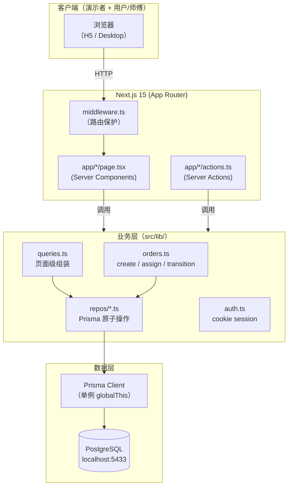
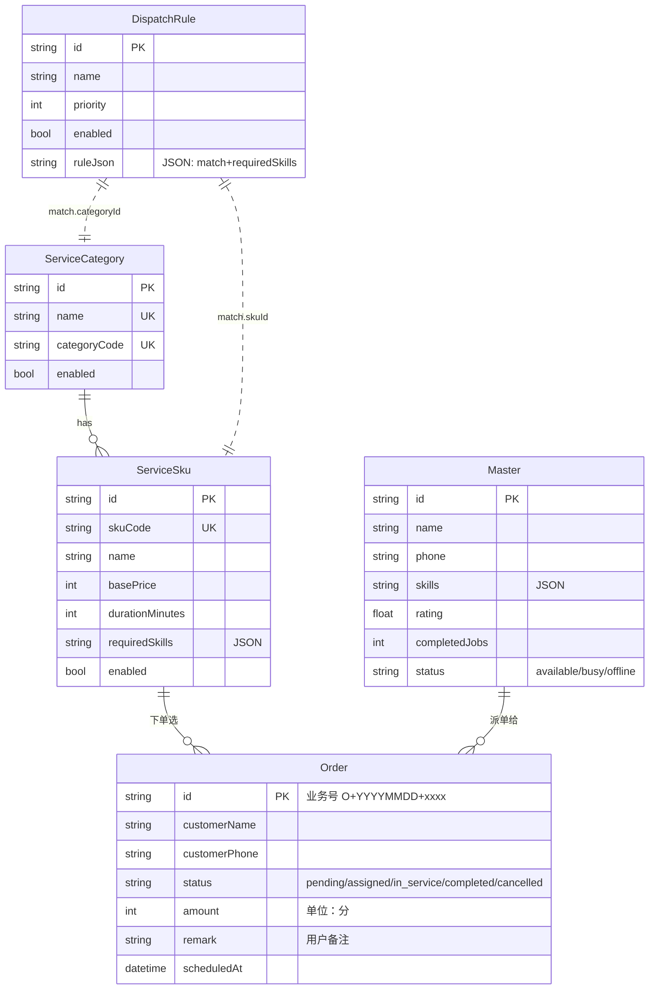

# O2O 上门服务 MVP（三端版）

> **为中小上门服务团队（家政 / 家电清洗 / 维修 / 母婴 / 应急）打造的 SaaS 雏形 —— 一个平台，三个角色，一套数据。**
>
> 客户在小程序下单，运营在后台派单，师傅在手机上接单。三端数据实时同步：从「待派单」到「已完成」全链路可见。
>
> 这是**第一版 MVP** —— 验证 O2O 业务闭环能跑通；不是「最终版产品」。

## 🚀 30 秒看懂（演示开场 hook）

| 角色        | 做什么                             | 在哪               |
| ----------- | ---------------------------------- | ------------------ |
| 👤 **客户** | 选服务 → 填联系方式 → 下单         | 用户端 `/customer` |
| 🛠️ **运营** | 看新订单 → 系统推荐师傅 → 一键派单 | 后台 `/orders`     |
| 🚗 **师傅** | 看分配订单 → 到场 → 完成           | 师傅端 `/worker`   |

**演示怎么跑**（4 步，15 分钟）：客户在小程序下个空调清洗单 → 运营在后台看到推荐师傅（孙师傅，技能匹配）→ 派给他 → 师傅在小程序看到「已派单」→ 点开始服务 → 完成 → 客户再打开查订单看到「已完成」。**4 步走完，全链路通了。**

## 🚀 5 分钟快速上手（新手只看这个）

```bash
# 1. 装依赖 + 准备本地环境
npm install
cp .env.example .env

# 2. 启动 PostgreSQL + 应用 migration + seed（首次运行约 1-2 分钟）
npm run db:start

# 3. 启动
npm run dev
# → http://localhost:3000

# 4. 照 [docs/DEMO.md](docs/DEMO.md) 跑 4 步演示（用户下单 → 后台派单 → 师傅履约 → 用户查询）
```

✅ 不需要外部 API key。数据库用本地 Docker PostgreSQL，`npm run db:start` 一条命令拉起并初始化。

❓ **跑不起来？** 看 [FAQ](#faq) 章节。

---

## 三端入口

| 入口                | 路径                                  | 说明                                  |
| ------------------- | ------------------------------------- | ------------------------------------- |
| 🛒 用户端下单       | http://localhost:3000/customer        | 选品类 → 填姓名/手机/地址/备注 → 提交 |
| 🔍 用户端查询       | http://localhost:3000/customer/orders | 输入手机号查订单状态                  |
| ⚙️ 后台管理         | http://localhost:3000/login           | admin / admin123，登录后跳 /dashboard |
| 🛠️ 师傅端           | http://localhost:3000/worker          | 选师傅 → 看分配订单 → 开始/完成服务   |
| 🏠 首页（三端总览） | http://localhost:3000/                | 三端入口卡片                          |

---

## 1. 项目目标

验证 O2O 上门服务平台的最小业务闭环：

- **服务供给侧**：管理员可配置服务品类 + 具体 SKU（含价格、技能要求）
- **师傅供给侧**：管理员可维护师傅信息（技能、评分、可接单状态）
- **派单规则侧**：管理员可配置 SKU 精确 / 类目兜底规则，影响自动派单
- **订单履约侧**：客户下单 → 系统自动推荐 → 人工派单 → 服务状态流转

---

## 2. 当前已实现功能

### Dashboard 数据概览

- 8 个核心统计卡（订单总数、待派单、已派单、服务中、已完成、可接单师傅、服务 SKU、派单规则）
- 完整 demo 链路指引

### 服务品类 / SKU 管理

- 类目 + SKU 两级管理
- SKU requiredSkills 字段驱动派单匹配
- 启用 / 停用开关

### 师傅管理

- 师傅信息 CRUD（name / phone / skills / rating / serviceArea）
- 系统**自动**管 status 字段（派单时 busy，完成时 available）—— UI 不暴露

### 派单规则管理

- SKU 精确匹配 + 品类兜底匹配
- 启用 / 停用切换（列表行内联）
- 优先级 priority（数字越大越优先）
- 必填技能 requiredSkills

### 订单创建

- 表单选 SKU（自动过滤已启用 + 已上架）
- 必填项校验（姓名、手机号、地址、时间、价格）
- 服务端业务编码大小写规范化

### 自动推荐师傅

- `recommendMastersForOrder()` 纯函数
- SKU 精确规则优先 → 类目兜底 → 无规则
- 师傅技能必须**覆盖** requiredSkills
- 候选按 rating 降序

### 正式派单

- 订单行内联「派给他」按钮
- 乐观锁防并发抢单
- 事务：订单 + 师傅 status 同时改

### 订单状态流转

- `pending` → `assigned`（派单）→ `in_service`（开始服务）→ `completed`（完成）
- 任何状态 → `cancelled`（取消订单，释放师傅）
- 乐观锁防重复操作

---

## 3. 技术栈

- **Next.js 15** —— App Router + RSC + Server Actions
- **TypeScript 5** —— 全栈类型安全
- **Prisma 5 + PostgreSQL 16** —— ORM + 本地 Docker 数据库
- **Vitest** —— 单元 + 端到端测试
- **tsx** —— 跑 seed 和 verify 脚本
- **GitHub Actions** —— CI（check + lint + test + build）
- **ESLint + Prettier + husky** —— pre-commit 自动 lint + format
- **@vitest/coverage-v8** —— 测试覆盖率报告（当前 81%+）

> 样式**未使用 Tailwind CSS** —— 全部用内联 `style` 属性（演示阶段简化，零配置）。
> 跑 `npm run lint:paths` 自动检查目录约定（防 `src/app/` 等踩坑）。

---

## 3.1 架构图



**关键设计**：

- `app/` 路由（Next.js 只认根，不认 `src/app/`）
- `actions/` 是写操作入口（form action 直接调）
- `src/lib/` 业务逻辑（pure functions + DB 调用）
- `repos/` 单表原子操作（Prisma 唯一入口）
- `middleware.ts` 路由保护（`PROTECTED_PATHS`）

---

## 3.2 数据模型（ER 图）



**核心约束**：

- `skuCode / categoryCode` 业务编码（应用层强制大写，跨数据库保持一致）
- `Order.amount` 单位是**分**（避免浮点）
- `Order.status` 终态：`completed` / `cancelled`
- `Master.status` 系统自动管（available → busy → available），UI 不暴露

---

## 4. 本地启动方式

### 开发模式（日常调试用）

```bash
# 1. 安装依赖
npm install

# 2. 启动 PostgreSQL + 应用 migration + 灌种子数据（首次启动必须）
cp .env.example .env
npm run db:start

# 3. 启动开发服务器
npm run dev
# → http://localhost:3000

# 4. 验证（DB + 类型检查 + 格式 + 测试 + 构建 + 页面 smoke）
npm run verify
```

### 生产模式（本地预览 prod build）

```bash
npm run build    # 生成 .next/ 优化产物
npm run start    # 启动 Next 生产 server（默认 3000 端口）
```

> ⚠️ 当前默认使用本地 Docker PostgreSQL。线上试用需要换成托管 PostgreSQL 并配置生产密钥。
> 详见 [docs/DEPLOYMENT.md](docs/DEPLOYMENT.md)。

### 常用命令

| 命令                        | 作用                                          |
| --------------------------- | --------------------------------------------- |
| `npm run dev`               | 启动 Next dev server                          |
| `npm run build`             | 生产构建（生成 .next/ 优化产物）              |
| `npm run start`             | 启动 Next 生产 server                         |
| `npm run verify`            | DB + check + format + test + build + smoke    |
| `npm run check`             | TypeScript + 目录/spec/process 检查           |
| `npm run lint:paths`        | 单独跑目录检查（防 `src/app/` / 根 lib 误用） |
| `npm run test:unit`         | 快速纯逻辑单测                                |
| `npm run test`              | 跑 Vitest 集成测试（含 DB 前置检查）          |
| `npm run smoke:pages`       | 启动生产 server 做页面 smoke                  |
| `npm run db:start`          | 启动本地 PostgreSQL + migrate + seed          |
| `npm run db:reset`          | 重置 PostgreSQL schema + seed                 |
| `npm run db:migrate:dev`    | prisma migrate dev                            |
| `npm run db:migrate:deploy` | prisma migrate deploy                         |
| `npm run db:studio`         | 打开 Prisma Studio（可视化 DB）               |
| `npm run db:seed`           | 只灌基础种子数据（不删 DB）                   |
| `npm run seed:demo`         | **一键重置完整演示数据**（覆盖三端完整链路）  |
| `npm run db:generate`       | 重新生成 Prisma Client（schema 改了才需要）   |

---

## 演示数据重置（v0.9.2）

`npm run seed:demo` 一键重置**完整演示数据**，覆盖三端完整链路（dashboard / 后台 / 用户 / 师傅）。**和 `db:seed` 互不影响** — `db:seed` 是最小种子，`seed:demo` 是完整演示。

```bash
npm run seed:demo
# 输出：✓ Category × 3 / SKU × 8 / Master × 4 / User × 7 / Order × 20 / Rule × 8 / ActivityLog × 10
#       pending × 8 / assigned × 4 / in_service × 4 / completed × 3 / cancelled × 1
```

### 演示账号

| 角色   | 账号        | 密码          | 绑定的实体 / 手机号 |
| ------ | ----------- | ------------- | ------------------- |
| 管理员 | `admin`     | `admin123`    | —                   |
| 用户   | `customer1` | `customer123` | 手机 `13900000099`  |
| 用户   | `customer2` | `customer123` | 手机 `13900000088`  |
| 师傅   | `worker1`   | `worker123`   | 李师傅（`T001`）    |
| 师傅   | `worker2`   | `worker123`   | 赵师傅（`T002`）    |
| 师傅   | `worker3`   | `worker123`   | 周姐（`T003`）      |
| 师傅   | `worker4`   | `worker123`   | 孙师傅（`T004`）    |

### 演示数据覆盖的场景

| 数据         | 覆盖内容                                                                    |
| ------------ | --------------------------------------------------------------------------- |
| 订单状态     | pending × 8 / assigned × 4 / in_service × 4 / completed × 3 / cancelled × 1 |
| 派单规则     | SKU 精确匹配 × 3 + 品类兜底 × 3 + 停用规则 × 1 + 「暂无推荐」规则 × 1       |
| 取消订单     | `cancelReason = "客户临时有事取消"`（演示 v0.9.0 业务规则 #14）             |
| 完成订单     | 3 条带 `serviceSummary`（演示师傅服务完成说明）                             |
| Activity Log | 覆盖 created / assigned / completed / canceled 4 种动作                     |

### 适用场景

- 演示 / 录视频前：跑 `seed:demo` 一键重置到完整演示状态
- 客户试用前：跑 `seed:demo` 让 dashboard / orders / customer / worker 端都有内容看
- 修 bug 后想恢复数据：跑 `seed:demo` 覆盖之前测试遗留

**不要在生产库跑**（会删所有订单 / 日志）。

---

## 5. 演示流程

按 Dashboard 上的「演示链路」分步骤操作（从 `/dashboard` 开始）：

| 步骤 | 页面                  | 操作                                                           |
| ---- | --------------------- | -------------------------------------------------------------- |
| 1    | `/services/skus/new`  | 新增服务 SKU（例：演示空调清洗，类目=演示家电，技能=空调维修） |
| 2    | `/masters/new`        | 新增师傅（技能包含「空调维修」，评分 4.95）                    |
| 3    | `/dispatch-rules/new` | 新增派单规则（SKU 精确匹配，priority 100）                     |
| 4    | `/orders/new`         | 创建订单（选刚才的 SKU）                                       |
| 5    | `/orders`             | pending 行点「派给他」→ 订单变「已派单」                       |
| 6    | `/orders`             | 点「开始服务」→ 订单变「服务中」                               |
| 7    | `/orders`             | 点「完成订单」→ 订单变「已完成」（师傅自动回 available）       |

### 师傅端 H5（`/worker`）

师傅端是独立路由，不在后台导航里 — 通过 `/worker?masterId=...` 直接访问。

| 步骤 | 页面                    | 操作                                                                        |
| ---- | ----------------------- | --------------------------------------------------------------------------- |
| 1    | `/worker`               | 顶部「选择师傅」下拉框（列所有师傅，手机尾号脱敏）                          |
| 2    | `/worker?masterId=T002` | 看到赵师傅被分配的所有订单（assigned / in_service / completed / cancelled） |
| 3    | `/worker?masterId=T002` | assigned 订单点「开始服务」→ 状态变 in_service；后台 `/orders` 同步刷新     |
| 4    | `/worker?masterId=T002` | in_service 订单点「完成订单」→ 状态变 completed；师傅自动回 available       |
| 5    | `/worker?masterId=T004` | 无订单的师傅显示「暂无分配订单」                                            |

**师傅端不做的事（按 MVP 范围）**：真实登录、短信验证、地图导航、上传图片、收款、评价、复杂权限。

### 用户端 H5（`/customer`）

用户下单独立 H5，不在后台导航里 — 通过 `/customer` 直接访问。

| 步骤 | 页面        | 操作                                                                          |
| ---- | ----------- | ----------------------------------------------------------------------------- |
| 1    | `/customer` | mobile 表单：选品类 → 联动 SKU 下拉 → 填姓名/手机/地址/备注                   |
| 2    | `/customer` | 点「提交订单」→ 调 `customerCreateOrderAction`（复用 `createOrder` 校验链路） |
| 3    | `/customer` | 成功展示订单号（如 `O202606270005`）+ 提示「我们会尽快安排师傅与您联系」      |
| 4    | `/orders`   | 新订单默认 status=pending + remark 入库；后台可见、可派单、可走推荐流程       |

**用户端不做的事（按 MVP 范围）**：真实登录、短信验证码、地图定位、支付、优惠券、在线客服、复杂 UI 框架。

**实现要点**：

- 金额自动取 SKU basePrice；预约时间默认「明天 10:00」（后台订单详情可改）
- schema 加了 `Order.remark` 字段（可选 String?）— 2026-06 用户端 MVP 引入

### 用户端查询（`/customer/orders`）

按手机号查询历史订单（演示期不验证手机号归属）。

| 步骤 | 页面                            | 操作                                           |
| ---- | ------------------------------- | ---------------------------------------------- |
| 1    | `/customer/orders`              | 输入 11 位手机号 → 点「查询」                  |
| 2    | `/customer/orders?phone=139xxx` | 看到该手机号的所有订单（按创建时间倒序）       |
| 3    | 切换手机号                      | 重新查询，按手机号隔离（不会泄露其他用户订单） |

### 完整演示链路

按这个顺序跑能覆盖三端：

1. **用户下单** → `/customer` 提交订单（记住订单号 / 手机号）
2. **后台派单** → `/orders` 看到 pending 订单，点「派给他」→ 状态「已派单」
3. **师傅履约** → `/worker?masterId=Txxx`（被派单的师傅）→ 点「开始服务」→ 「完成订单」
4. **用户查询** → `/customer/orders?phone=xxx` 看订单状态从「待派单」→「已派单」→「服务中」→「已完成」

详细脚本见 [docs/DEMO.md](docs/DEMO.md)。

### 关键交互

- **派单失败演示**：把规则 enabled 改 false 后创建订单 → 系统提示「暂无可派单师傅」
- **状态机互锁**：completed 订单不能再派单（点按钮报 validation 错）
- **enabled=false 规则**：列表行内联「启用」/「停用」按钮（带乐观更新）
- **SKU 优先 vs 品类兜底**：同时配 SKU 精确规则（priority=100）和品类兜底（priority=10）→ 优先命中 SKU

---

## 6. 当前限制

MVP 阶段**故意没做**：

- ❌ 真实登录（用 mock 状态）
- ❌ 支付（订单金额只展示，不结算）
- ❌ 短信 / 通知
- ❌ 地图 / 距离计算
- ❌ 师傅端 App（只有 H5 最小版 `src/lib/worker.ts` + `app/worker/`）
- ❌ 用户端 App（只有 H5 最小版 `src/lib/customer.ts` + `app/customer/`）
- ❌ 商家端 / 多租户
- ❌ 复杂权限（单管理员账号）
- ❌ 删除功能（编辑里有 enabled 替代删除）
- ❌ 托管生产数据库（本地默认 Docker PostgreSQL，线上要换托管 PostgreSQL）
- ❌ 部署上线

---

## 7. 下一阶段规划

按业务价值排序：

### 短期（下一步）

- 基础登录（邮箱 + 密码 / 第三方 OAuth）
- 权限角色（管理员 / 客服 / 运营）

### 中期

- 订单筛选 + 搜索（按状态、时间、客户、师傅）
- 真实数据库（Postgres）
- 部署上线（Vercel / 自建 K8s）

### 长期

- 师傅端 App（原生；H5 最小版已上线 — 看历史 / 接单 / 改状态）
- 商家端 / 多租户
- 支付 + 发票
- 地图 + 派单距离
- 评价系统
- 数据看板（BI）

---

## 8. 状态机

```
        ┌─ 取消 ───────┐
        ↓              │
pending → assigned → in_service → completed
   │         │            │       (终态)
   │         └──── 取消 ──┴── 取消 ──→ cancelled
   │                              (终态)
   └─ 取消 ──→ cancelled
```

- **派单** (`assignOrder`)：事务里改订单 + 师傅 status (available→busy)
- **完成 / 取消** (`transitionOrder`)：事务里改订单 + 师傅 status (busy→available)
- **乐观锁** (`updateMany` + `status` 条件) 防并发抢单

---

## 9. 数据模型

7 张表：

- `ServiceCategory` — 服务类目（家政 / 家电清洗 / 维修 / 母婴 / 应急）
- `ServiceSku` — 具体服务 SKU（含 requiredSkills JSON 数组）
- `Master` — 师傅信息
- `Order` — 订单（含 serviceName / masterName snapshot 防止 SKU/师傅改名影响历史）
- `DispatchRule` — 派单规则（ruleJson 里存 `{match: {skuId|categoryId}, requiredSkills}`）
- `User` — 登录账号（三角色：admin / worker / customer）
- `ActivityLog` — 操作日志（订单创建、派单、取消、完成等）

`schema.prisma` 里有详细注释。

---

## 10. 项目约定

- 写代码前**先**看 `CLAUDE.md`（项目内规则速查）
- 每个新阶段必走「**先问 + 排优先级 + 不猜**」
- 改 schema / mock-data → 立刻 `npm run db:start` + `npm run verify`
- 测试断言 = 规格，不是现状
- 写代码前**先 `npm run check`** 验证类型 + 目录约定

---

## FAQ

### Q: 启动报 "Prisma Client is not generated" 怎么办？

```bash
npm run db:generate   # 重新生成 Prisma Client
npm run dev
```

### Q: 改了代码没生效？

Next.js dev server 有 `.next/` 缓存。极端情况（schema 改完、worker.ts 改了等）需要清缓存重启：

```bash
pkill -f "next dev"
rm -rf .next
npm run dev
```

### Q: `npm run db:reset` 会删数据吗？

**会。** 它会重置当前 `DATABASE_URL` 指向的 PostgreSQL schema，再重新 seed。只用于本地演示/开发库，不能对生产库执行。

### Q: 访问 `/dashboard` 被跳到 `/login`？

后台受 middleware 保护，没登录会跳登录页。账号：`admin` / 密码：`admin123`。

### Q: 端口 3000 被占用？

```bash
PORT=3001 npm run dev
# 或找到占用进程杀掉
lsof -ti:3000 | xargs kill -9
```

### Q: 下了单 /orders 看不到？

- 确认后台已登录（未登录跳 /login）
- 确认手机号 / 品类选了（用户端表单联动）
- 确认 submit 看到订单号（没看到订单号就是没成功）

### Q: `/worker?masterId=Txxx` 看不到订单？

- 确认该师傅被分配了订单（`/masters` 看 masterId）
- 订单状态必须是 assigned / in_service / completed / cancelled 之一（pending 不显示）

### Q: 「订单完成」按钮点了没反应？

dev 模式如果 server action 抛错，dev server stdout 会显示错误。最常见是本地 PostgreSQL 没启动或 seed 没跑过。先 `npm run db:start`。

### Q: 跑测试失败 / 281 个测试中失败几条？

最常见是**测试间数据残留**：

```bash
npm run db:start
npm run verify
```

---

## 相关文档

- [docs/DEMO.md](docs/DEMO.md) — 4 步演示脚本（用户下单 → 后台派单 → 师傅履约 → 用户查询）
- [docs/DEPLOYMENT.md](docs/DEPLOYMENT.md) — 本地运行 / PostgreSQL / 部署限制
- [docs/postgresql-migration.md](docs/postgresql-migration.md) — 历史迁移评估归档
- [docs/sqlite-to-postgres-data-migration.md](docs/sqlite-to-postgres-data-migration.md) — 历史数据迁移手册归档
- [docs/FEEDBACK.md](docs/FEEDBACK.md) — 试用反馈模板
